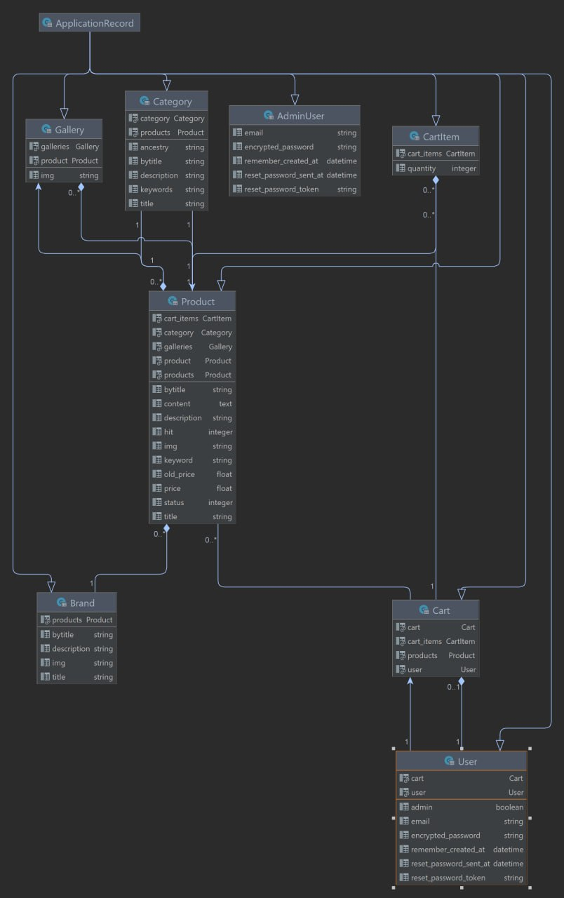

# Jizue - BackEnd

Ruby version => "3.2.2"
Rails version => "7.0.4.3"

## Summary

This is a online clothes store Jizue designed to allow users to buy clothes remotely. 

Users can register and log in. Also he can switch categories and add clothes to cart. Each peace of clothing has price, images, sale etc. Also, this project contains logic with recenly checked clothes and hits.

## Setup

1. Clone down this repo and cd into the directory

2. Run 
`bundle install`

3. Run
`rails db:migrate`

4. Run
`rails db:seed`

5. Run
`rails s`

6. Rails should be running the api on http://localhost:3000.

## Gems

- activeadmin
- simple_form
- devise
- ancestry
- breadcrumbs_on_rails
- meta-tags
- activestorage
- bootstrap-sass
- coffee-rails
- jbuilder
- jquery-rails
- oj
- oj_mimic_json
- pg
- puma
- sass-rails
- turbolinks
- uglifier
- sprockets-rails
- importmap-rails
- turbo-rails
- stimulus-rails

## ERD diagram

## HTTP Verbs
| HTTP METHOD | URL                    | Payload | Description            |
|-------------|------------------------|---------|------------------------|
| GET         | /users/sign_in         | {}      | new_user_session       |
| POST        | /users/sign_in         | {}      | user_session           |
| DELETE      | /users/sign_out        | {}      | destroy_user_session   |
| GET         | /users/password/new    | {}      | new_user_password      |
| GET         | /users/password/edit   | {}      | edit_user_password     |
| PATCH       | /users/password        | {}      | user_password          |
| PUT         | /users/password        | {}      | user_password          |
| POST        | /users/password        | {}      | user_password          |
| GET         | /users/cancel          | {}      | cancel_user_registratio|
| GET         | /users/sign_up         | {}      | new_user_registration  |
| GET         | /users/edit            | {}      | edit_user_registration |
| PATCH       | /users                 | {}      | user_registration      |
| PUT         | /users                 | {}      | user_registration      |
| DELETE      | /users                 | {}      | user_registration      |
| POST        | /users                 | {}      | user_registration      |
| GET         | /product/:id           | {}      | product                |
| GET         | /category/:id          | {}      | category               |
| GET         | /brand/:id             | {}      | brand                  |
| POST        | /cart/items            | {}      | cart_items             |
| DELETE      | /cart/items/:id        | {}      | cart_item              |
| GET         | /cart                  | {}      | cart                   |
| DELETE      | /cart                  | {}      | destroy cart           |
| GET         | /search                | {}      | search_index           |
| GET         | /                      | {}      | root                   |

